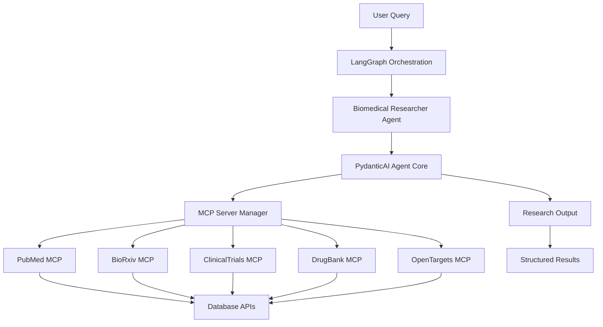

# Biomedical Researcher Agent

## Overview

The Biomedical Researcher Agent is a sophisticated AI agent that combines **PydanticAI**, **Model Context Protocol (MCP)** servers, and **LangGraph** orchestration to provide comprehensive biomedical research capabilities. This agent can access multiple biomedical databases and provide evidence-based research insights with proper citations and confidence assessments.

## Architecture



## Key Features

### 🔬 Multi-Database Access
- **PubMed**: Comprehensive biomedical literature search
- **BioRxiv/MedRxiv**: Latest preprints and early research
- **ClinicalTrials.gov**: Clinical trial information and protocols
- **DrugBank**: Drug information and interactions (requires API key)
- **Open Targets**: Disease-target associations and genetic evidence

### 🤖 Advanced AI Capabilities
- **PydanticAI Integration**: Type-safe agent with structured outputs
- **Reasoning Model**: Uses advanced reasoning models for complex analysis
- **Streaming Support**: Real-time research output streaming
- **Error Handling**: Robust error handling with fallback responses

### 🔄 LangGraph Orchestration
- **Seamless Integration**: Works within existing LangGraph workflows
- **State Management**: Proper state passing and result aggregation
- **Async Support**: Full asynchronous operation for performance

### 📊 Structured Outputs
- **Research Summary**: Concise overview of findings
- **Key Findings**: Bullet-pointed discoveries with citations
- **Source Attribution**: Proper citation of all sources
- **Recommendations**: Actionable next steps
- **Confidence Assessment**: Quantified confidence in findings (0-1 scale)

## Installation

### 1. Install Dependencies

```bash
pip install -r requirements_biomedical.txt
```

### 2. Configure Environment Variables

```bash
# Required: LLM API Key (choose one)
export OPENAI_API_KEY="your-openai-api-key"
# OR
export ANTHROPIC_API_KEY="your-anthropic-api-key"

# Optional: DrugBank API Key for drug information access
export DRUGBANK_API_KEY="your-drugbank-api-key"

# Optional: Custom LLM endpoint
export BASE_URL="https://api.openai.com/v1"
export LLM_API_KEY="your-llm-api-key"
```

### 3. Verify MCP Servers

Ensure the biomedical MCP servers are available:

```bash
# Check if MCP server files exist
ls src/service/mcps/
# Should show: pubmed_mcp.py, bioarxiv_mcp.py, clinicaltrialsgov_mcp.py, etc.
```

## Usage

### Standalone Usage

```python
import asyncio
from src.agents.biomedical_researcher import (
    BiomedicalResearchDeps,
    biomedical_researcher_wrapper
)

async def research_example():
    # Define research context
    deps = BiomedicalResearchDeps(
        user_context="Clinical oncologist",
        research_focus="cancer immunotherapy",
        time_range="last 18 months",
        preferred_databases=["pubmed", "clinicaltrials"]
    )
    
    # Conduct research
    async with biomedical_researcher_wrapper as researcher:
        result = await researcher.run_research(
            "What are the latest CAR-T cell therapy developments?", 
            deps
        )
        
        print(f"Summary: {result.summary}")
        print(f"Confidence: {result.confidence_level:.1%}")
        
        for finding in result.key_findings:
            print(f"- {finding}")

asyncio.run(research_example())
```

### LangGraph Integration

```python
from src.agents.biomedical_researcher import biomedical_researcher_node

# In your LangGraph workflow
async def my_workflow_node(state):
    # Add biomedical research context to state
    state.update({
        "user_context": "Neurologist",
        "research_focus": "Alzheimer's disease",
        "time_range": "last 2 years"
    })
    
    # Run biomedical research
    result_state = await biomedical_researcher_node(state)
    
    # Access research results
    research_result = result_state["biomedical_research_result"]
    return result_state
```

### Streaming Research

```python
async def streaming_research():
    deps = BiomedicalResearchDeps(
        user_context="Public health researcher",
        research_focus="vaccine effectiveness"
    )
    
    async with biomedical_researcher_wrapper as researcher:
        async for chunk in researcher.run_research_stream(
            "Compare COVID-19 vaccine effectiveness", deps
        ):
            print(chunk, end='', flush=True)
```

## Configuration

### Research Dependencies

The `BiomedicalResearchDeps` class allows you to customize the research context:

```python
deps = BiomedicalResearchDeps(
    user_context="Clinical researcher specializing in cardiology",
    research_focus="heart failure treatments",
    time_range="last 3 years",
    preferred_databases=["pubmed", "clinicaltrials", "drugbank"]
)
```

### Model Configuration

The agent automatically selects the appropriate model based on your configuration:

- **Reasoning Model**: Uses the `reasoning` model type for complex analysis
- **Auto-Detection**: Automatically detects and configures OpenAI or Anthropic models
- **Fallback**: Gracefully falls back to GPT-4o if model detection fails

### MCP Server Configuration

MCP servers are automatically configured based on available files and API keys:

- **PubMed**: Always available (no API key required)
- **BioRxiv**: Always available (no API key required)  
- **ClinicalTrials**: Always available (no API key required)
- **DrugBank**: Requires `DRUGBANK_API_KEY` environment variable
- **OpenTargets**: Always available (no API key required)

## Output Structure

The agent returns structured `BiomedicalResearchOutput` objects:

```python
class BiomedicalResearchOutput(BaseModel):
    summary: str                    # Executive summary
    key_findings: List[str]         # Key discoveries
    sources: List[Dict[str, str]]   # Citations and sources
    recommendations: List[str]      # Actionable recommendations
    confidence_level: float         # Confidence (0.0-1.0)
```

Example output:

```json
{
    "summary": "Recent advances in CAR-T cell therapy show promising results...",
    "key_findings": [
        "95% remission rate in pediatric ALL patients",
        "New targeting mechanisms reduce side effects",
        "Combination therapies show enhanced efficacy"
    ],
    "sources": [
        {"title": "CAR-T Advances in 2024", "pmid": "12345", "journal": "Nature"},
        {"trial_id": "NCT12345678", "title": "CAR-T Combination Study"}
    ],
    "recommendations": [
        "Consider clinical trial enrollment for eligible patients",
        "Monitor for cytokine release syndrome",
        "Follow updated safety guidelines"
    ],
    "confidence_level": 0.85
}
```

## Testing

### Unit Tests

```bash
# Run all biomedical researcher tests
python -m pytest tests/test_biomedical_researcher.py -v

# Run specific test classes
python -m pytest tests/test_biomedical_researcher.py::TestLangGraphIntegration -v
```

### Integration Demo

```bash
# Run the comprehensive demo
python tests/demo_biomedical_researcher.py

# Run interactive demo
python tests/demo_biomedical_researcher.py --interactive
```

### Test Coverage

The test suite covers:

- ✅ Data model validation
- ✅ MCP server configuration
- ✅ Model selection logic
- ✅ Wrapper class functionality
- ✅ LangGraph integration
- ✅ Error handling
- ✅ End-to-end workflows

## Integration Patterns

### 1. LangGraph Node Integration

```python
from langgraph.graph import StateGraph
from src.agents.biomedical_researcher import biomedical_researcher_node

# Add to your graph
builder = StateGraph(MyState)
builder.add_node("biomedical_research", biomedical_researcher_node)
builder.add_edge("planning", "biomedical_research")
builder.add_edge("biomedical_research", "synthesis")
```

### 2. Multi-Agent Coordination

```python
async def coordinated_research(state):
    # First, use general research
    state = await general_research_node(state)
    
    # Then, use specialized biomedical research
    state = await biomedical_researcher_node(state)
    
    # Finally, synthesize results
    return await synthesis_node(state)
```

### 3. Conditional Research

```python
def should_use_biomedical_research(state) -> bool:
    query = state.get("query", "").lower()
    biomedical_keywords = [
        "disease", "drug", "therapy", "clinical", "medical",
        "gene", "protein", "cancer", "treatment", "vaccine"
    ]
    return any(keyword in query for keyword in biomedical_keywords)

# Use in conditional edges
builder.add_conditional_edges(
    "classify_query",
    should_use_biomedical_research,
    {
        True: "biomedical_research",
        False: "general_research"
    }
)
```

## Troubleshooting

### Common Issues

1. **MCP Server Not Found**
   ```
   Error: No such file or directory: 'src/service/mcps/pubmed_mcp.py'
   ```
   - Ensure MCP server files are in the correct location
   - Check file permissions

2. **API Key Issues**
   ```
   Error: Authentication failed
   ```
   - Verify API keys are set correctly
   - Check API key permissions and quotas

3. **Import Errors**
   ```
   ModuleNotFoundError: No module named 'pydantic_ai'
   ```
   - Install required dependencies: `pip install -r requirements_biomedical.txt`

4. **Async Context Issues**
   ```
   RuntimeError: Cannot run MCP servers outside async context
   ```
   - Ensure proper use of `async with biomedical_researcher_wrapper`

### Debug Mode

Enable debug logging:

```python
import logging
logging.basicConfig(level=logging.DEBUG)

# Or specifically for biomedical research
logger = logging.getLogger('src.agents.biomedical_researcher')
logger.setLevel(logging.DEBUG)
```

## Performance Considerations

### MCP Server Management
- MCP servers are started once per session and reused
- Use the wrapper's async context management for proper lifecycle
- Servers are automatically cleaned up on exit

### Concurrent Research
- The agent supports concurrent queries through proper async design
- Use asyncio.gather() for parallel research tasks
- Each query maintains its own context and dependencies

### Memory Usage
- Research outputs are structured and memory-efficient
- Large result sets are streamed when possible
- MCP servers handle their own memory management

## Contributing

### Adding New MCP Servers

1. Create new MCP server in `src/service/mcps/`
2. Add server configuration in `create_biomedical_mcp_servers()`
3. Update documentation and tests
4. Add appropriate tool prefix

### Extending Research Capabilities

1. Add new tools to the PydanticAI agent
2. Update the prompt template if needed
3. Add corresponding tests
4. Update documentation

### Example: Adding a New Database

```python
# In create_biomedical_mcp_servers()
new_db_server = MCPServerStdio(
    'python',
    [os.path.join(mcps_dir, 'new_db_mcp.py')],
    tool_prefix='newdb'
)
mcp_servers.append(new_db_server)
```

## License

This biomedical researcher agent is part of the larger LangManus project and follows the same licensing terms.

## Support

For issues specific to the biomedical researcher agent:

1. Check the troubleshooting section above
2. Run the demo script to verify functionality
3. Check the test suite for examples
4. Review the MCP server documentation in `src/service/mcps/README.md`

For general questions about PydanticAI, MCP, or LangGraph integration patterns, refer to the respective project documentation. 